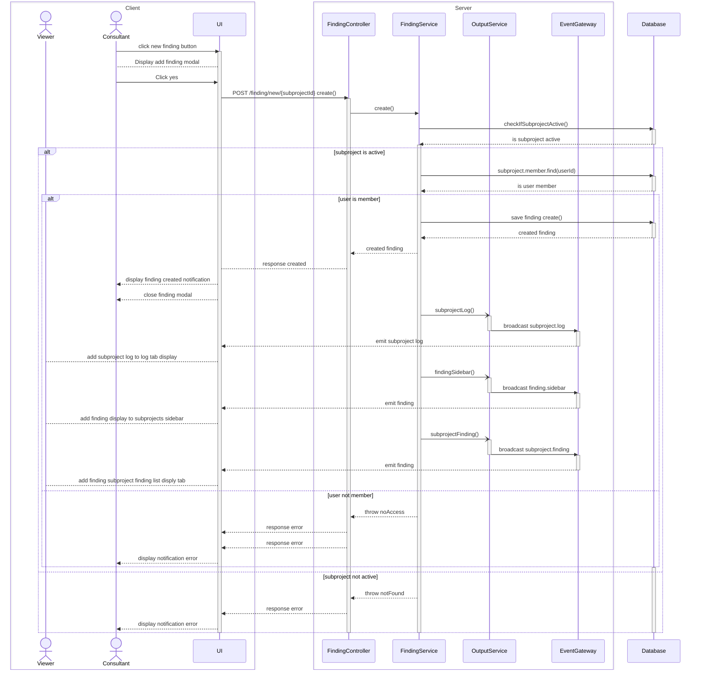

# Sequence Diagram: Create Finding

```mermaid

    sequenceDiagram

        box Client
        actor Viewer
        actor Consultant
        participant UI
        end

        box Server
        participant FindingController
        participant FindingService
        participant OutputService
        participant EventGateway
        end

        participant Database

        Consultant->>UI: click new finding button
        activate UI
        UI-->Consultant: Display add finding modal
        Consultant->>UI: Click yes
        UI->>FindingController: POST /finding/new/{subprojectId} create()
        activate FindingController
        FindingController->>FindingService: create()
        FindingService->>Database: checkIfSubprojectActive()
        activate Database
        Database-->>FindingService: is subproject active
        deactivate Database
        activate FindingService
        alt subproject is active
            FindingService->>Database: subproject.member.find(userId)
            activate Database
            Database-->>FindingService: is user member
            deactivate Database
            alt user is member
                FindingService->>Database: save finding create()
                activate Database
                Database-->>FindingService: created finding
                deactivate Database
                FindingService-->>FindingController: created finding
                FindingController-->UI: response created
                UI-->>Consultant: display finding created notification
                UI-->>Consultant: close finding modal 
                
                FindingService-)OutputService: subprojectLog()
                activate OutputService
                OutputService->>EventGateway: broadcast subproject.log
                activate EventGateway
                deactivate OutputService
                EventGateway-->>UI: emit subproject log
                deactivate EventGateway 
                UI-->Viewer: add subproject log to log tab display

                FindingService-)OutputService: findingSidebar()
                activate OutputService
                OutputService->>EventGateway: broadcast finding.sidebar
                activate EventGateway
                deactivate OutputService
                EventGateway-->>UI: emit finding
                deactivate EventGateway 
                UI-->Viewer: add finding display to subprojects sidebar

                FindingService-)OutputService: subprojectFinding()
                activate OutputService
                OutputService->>EventGateway: broadcast subproject.finding
                activate EventGateway
                deactivate OutputService
                EventGateway-->>UI: emit finding
                deactivate EventGateway 
                UI-->Viewer: add finding subproject finding list disply tab

            else user not member
                FindingService-->>FindingController: throw noAccess
                FindingController-->>UI: response error
                FindingController-->>UI: response error
                UI-->>Consultant: display notification error
            end
            activate Database 
        else subproject not active
            FindingService-->>FindingController: throw notFound
            FindingController-->>UI: response error
            UI-->>Consultant: display notification error
        end 
        deactivate Database
        deactivate FindingService
        deactivate FindingController
        deactivate UI
```
