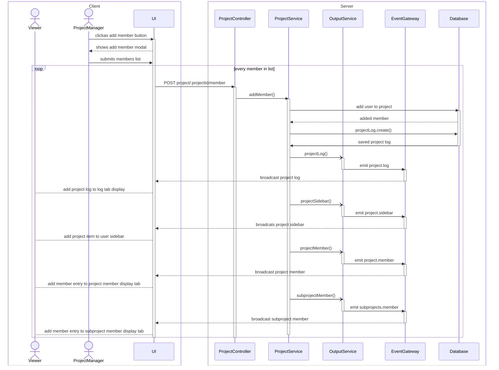

# Sequence Diagram: Add Member

```mermaid

    sequenceDiagram

        box Client
        actor Viewer
        actor ProjectManager
        participant UI
        end

        box Server
        participant ProjectController
        participant ProjectService
        participant OutputService
        participant EventGateway
        participant Database
        end

        ProjectManager->>UI: clickas add member button
        activate UI
        UI-->>ProjectManager: shows add member modal
        ProjectManager->>UI: submits members list 
        loop every member in list
            UI->>ProjectController: POST project/:projectId/member
            activate ProjectController
            ProjectController->>ProjectService: addMember()
            activate ProjectService
            ProjectService->>Database: add user to project
            activate Database
            Database-->>ProjectService: added member
            ProjectService->>Database: projectLog.create()
            Database->>ProjectService: saved project log
            deactivate Database 

            ProjectService-)OutputService: projectLog()
            activate OutputService
            OutputService->>EventGateway: emit project.log
            activate EventGateway
            deactivate OutputService
            EventGateway-->>UI: broadcast project log
            deactivate EventGateway 
            UI-->Viewer: add project log to log tab display

            ProjectService-)OutputService: projectSidebar()
            activate OutputService
            OutputService->>EventGateway: emit project.sidebar
            activate EventGateway
            deactivate OutputService
            EventGateway-->>UI: broadcats project sidebar
            deactivate EventGateway 
            UI-->Viewer: add project item to user sidebar

            ProjectService-)OutputService: projectMember()
            activate OutputService
            OutputService->>EventGateway: emit project.member
            activate EventGateway
            deactivate OutputService
            EventGateway-->>UI: broadcast project member
            deactivate EventGateway 
            UI-->Viewer: add member entry to project member display tab

            ProjectService-)OutputService: subprojectMember()
            activate OutputService
            OutputService->>EventGateway: emit subprojects.member
            activate EventGateway
            deactivate OutputService
            EventGateway-->>UI: broadcast subproject member
            deactivate EventGateway 
            UI-->Viewer: add member entry to subproject member display tab

            deactivate ProjectService
        end

        deactivate ProjectController
        deactivate UI
```
