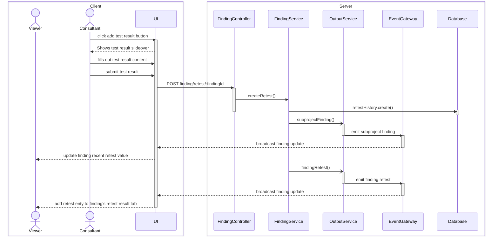

# Sequence Diagram: Add Retest Result

```mermaid

    sequenceDiagram

        box Client
        actor Viewer
        actor Consultant
        participant UI
        end

        box Server
        participant FindingController
        participant FindingService
        participant OutputService
        participant EventGateway
        participant Database
        end


        Consultant->>UI: click add test result button
        activate UI
        UI-->>Consultant: Shows test result slideover
        Consultant->>UI: fills out test result content
        Consultant->>UI: submit test result

        UI->>FindingController: POST finding/retest/:findingId
        activate FindingController
        FindingController->>FindingService: createRetest()
        FindingService->>Database: retestHistory.create()
        activate Database
        deactivate Database
        deactivate FindingController

        FindingService-)OutputService: subprojectFinding()
        activate OutputService
        OutputService->>EventGateway: emit subproject finding
        activate EventGateway
        deactivate OutputService
        EventGateway-->>UI: broadcast finding update
        deactivate EventGateway
        UI-->>Viewer: update finding recent retest value

        FindingService-)OutputService: findingRetest()
        activate OutputService
        OutputService->>EventGateway: emit finding retest
        activate EventGateway
        deactivate OutputService
        EventGateway-->>UI: broadcast finding update
        deactivate EventGateway
        UI-->>Viewer: add retest enty to finding's retest result tab 

        deactivate UI
        
```
