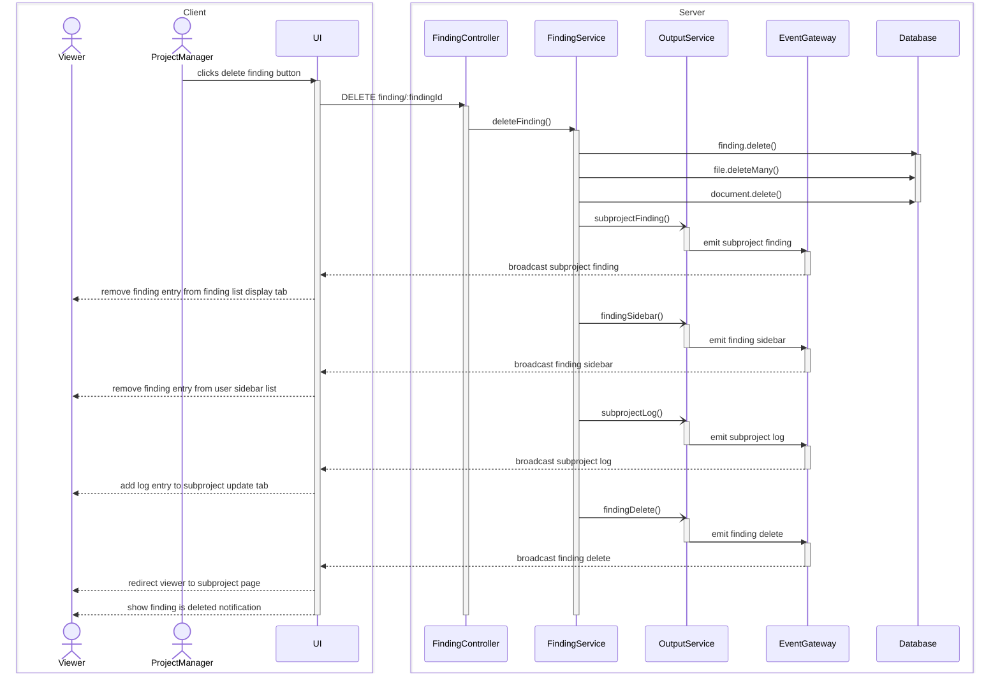

# Sequence Diagram: Approve Finding Deletion

```mermaid

    sequenceDiagram

        box Client
        actor Viewer
        actor ProjectManager
        participant UI
        end

        box Server
        participant FindingController
        participant FindingService
        participant OutputService
        participant EventGateway
        participant Database
        end

        ProjectManager->>UI: clicks delete finding button
        activate UI
        UI->>FindingController: DELETE finding/:findingId
        activate FindingController
        FindingController->>FindingService: deleteFinding()
        activate FindingService
        
        FindingService->>Database: finding.delete()
        activate Database
        FindingService->>Database: file.deleteMany()
        FindingService->>Database: document.delete()
        deactivate Database

        FindingService-)OutputService: subprojectFinding()
        activate OutputService
        OutputService->>EventGateway: emit subproject finding
        activate EventGateway
        deactivate OutputService
        EventGateway-->>UI: broadcast subproject finding
        deactivate EventGateway 
        UI-->>Viewer: remove finding entry from finding list display tab

        FindingService-)OutputService: findingSidebar()
        activate OutputService
        OutputService->>EventGateway: emit finding sidebar
        activate EventGateway
        deactivate OutputService
        EventGateway-->>UI: broadcast finding sidebar
        deactivate EventGateway 
        UI-->>Viewer: remove finding entry from user sidebar list

        FindingService-)OutputService: subprojectLog()
        activate OutputService
        OutputService->>EventGateway: emit subproject log
        activate EventGateway
        deactivate OutputService
        EventGateway-->>UI: broadcast subproject log
        deactivate EventGateway 
        UI-->>Viewer: add log entry to subproject update tab

        FindingService-)OutputService: findingDelete()
        activate OutputService
        OutputService->>EventGateway: emit finding delete
        activate EventGateway
        deactivate OutputService
        EventGateway-->>UI: broadcast finding delete
        deactivate EventGateway 
        UI-->>Viewer: redirect viewer to subproject page
        UI-->>Viewer: show finding is deleted notification

        deactivate FindingService
        deactivate FindingController
        deactivate UI
```
