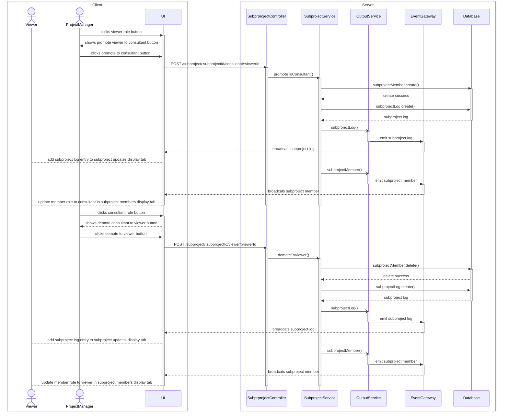

# Sequence Diagram: Change Member Role

```mermaid

    sequenceDiagram

        box Client
        actor Viewer
        actor ProjectManager
        participant UI
        end

        box Server
        participant SubprprojectController
        participant SubprojectService
        participant OutputService
        participant EventGateway
        participant Database
        end

        ProjectManager->>UI: clicks viewer role button
        activate UI
        UI-->>ProjectManager: shows promote viewer to consultant button
        ProjectManager->>UI: clicks promote to consultant button
        UI->>SubprprojectController: POST /subproject/:subprojectId/consultant/:viewerId
        activate SubprprojectController
        SubprprojectController->>SubprojectService: promoteToConsultant()
        activate SubprojectService
        SubprojectService->>Database: subprojectMember.create()
        activate Database
        Database-->>SubprojectService: create success
        SubprojectService->>Database:subprojectLog.create()
        Database-->>SubprojectService: subproject log 
        deactivate Database

        SubprojectService-)OutputService: subprojectLog()
        activate OutputService
        OutputService->>EventGateway: emit subproject log
        activate EventGateway
        deactivate OutputService
        EventGateway-->>UI: broadcats subproject log
        deactivate EventGateway 
        UI-->Viewer: add subproject log entry to subproject updates display tab 

        SubprojectService-)OutputService: subprojectMember()
        activate OutputService
        OutputService->>EventGateway: emit subproject member
        activate EventGateway
        deactivate OutputService
        EventGateway-->>UI: broadcats subproject member
        deactivate EventGateway 
        UI-->Viewer: update member role to consultant in subproject members display tab

        deactivate SubprojectService
        deactivate SubprprojectController

        deactivate UI

        ProjectManager->>UI: clicks consultant role button
        activate UI
        UI-->>ProjectManager: shows demote consultant to viewer button
        ProjectManager->>UI: clicks demote to viewer button
        UI->>SubprprojectController: POST /subproject/:subprojectId/viewer/:viewerId
        activate SubprprojectController
        SubprprojectController->>SubprojectService: demoteToViewer()
        activate SubprojectService
        SubprojectService->>Database: subprojectMember.delete()
        activate Database
        Database-->>SubprojectService: delete success
        SubprojectService->>Database:subprojectLog.create()
        Database-->>SubprojectService: subproject log 
        deactivate Database

        SubprojectService-)OutputService: subprojectLog()
        activate OutputService
        OutputService->>EventGateway: emit subproject log
        activate EventGateway
        deactivate OutputService
        EventGateway-->>UI: broadcats subproject log
        deactivate EventGateway 
        UI-->Viewer: add subproject log entry to subproject updates display tab 

        SubprojectService-)OutputService: subprojectMember()
        activate OutputService
        OutputService->>EventGateway: emit subproject member
        activate EventGateway
        deactivate OutputService
        EventGateway-->>UI: broadcats subproject member
        deactivate EventGateway 
        UI-->Viewer: update member role to viewer in subproject members display tab

        deactivate SubprojectService
        deactivate SubprprojectController

        deactivate UI

```
