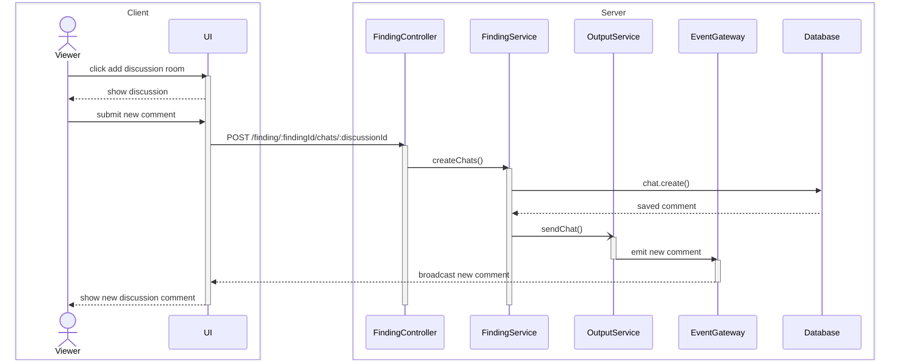

# Sequence Diagram: Create Chat

```mermaid

    sequenceDiagram

        box Client
        actor Viewer
        participant UI
        end

        box Server
        participant FindingController
        participant FindingService
        participant OutputService
        participant EventGateway
        participant Database
        end

        Viewer->>UI: click add discussion room 
        activate UI
        UI-->>Viewer: show discussion 
        Viewer->>UI: submit new comment
        UI->>FindingController: POST /finding/:findingId/chats/:discussionId
        activate FindingController
        FindingController->>FindingService: createChats()
        activate FindingService
        FindingService->>Database: chat.create()  
        activate Database
        Database-->>FindingService: saved comment
        

        FindingService-)OutputService: sendChat()
        activate OutputService
        OutputService->>EventGateway: emit new comment
        activate EventGateway 
        deactivate OutputService
        EventGateway-->>UI: broadcast new comment
        deactivate EventGateway
        UI-->>Viewer: show new discussion comment 
        deactivate FindingService

        deactivate FindingController
        deactivate UI 
```
