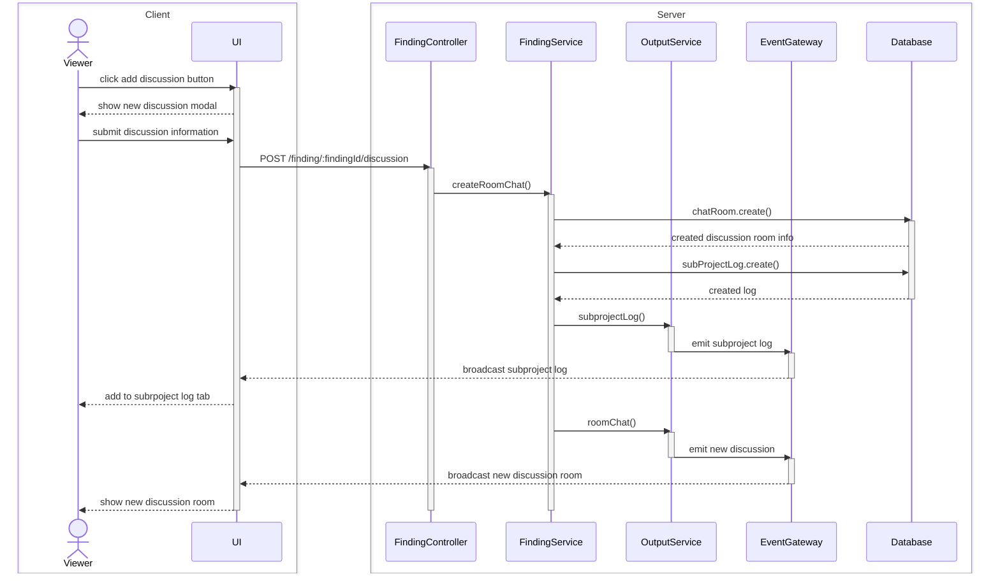

# Sequence Diagram: Create Discussion

```mermaid

    sequenceDiagram

        box Client
        actor Viewer
        participant UI
        end

        box Server
        participant FindingController
        participant FindingService
        participant OutputService
        participant EventGateway
        participant Database
        end

        Viewer->>UI: click add discussion button
        activate UI
        UI-->>Viewer: show new discussion modal
        Viewer->>UI: submit discussion information
        UI->>FindingController: POST /finding/:findingId/discussion
        activate FindingController
        FindingController->>FindingService: createRoomChat()
        activate FindingService
        FindingService->>Database: chatRoom.create()  
        activate Database
        Database-->>FindingService: created discussion room info
        
        FindingService->>Database: subProjectLog.create()
        Database-->>FindingService: created log 
        deactivate Database
        
        FindingService->>OutputService: subprojectLog()
        activate OutputService
        OutputService->>EventGateway: emit subproject log
        activate EventGateway 
        deactivate OutputService
        EventGateway-->>UI: broadcast subproject log
        deactivate EventGateway
        UI-->>Viewer: add to subrpoject log tab

        FindingService->>OutputService: roomChat()
        activate OutputService
        OutputService->>EventGateway: emit new discussion
        activate EventGateway 
        deactivate OutputService
        EventGateway-->>UI: broadcast new discussion room
        deactivate EventGateway
        UI-->>Viewer: show new discussion room 
        deactivate FindingService

        deactivate FindingController
        deactivate UI 
```
