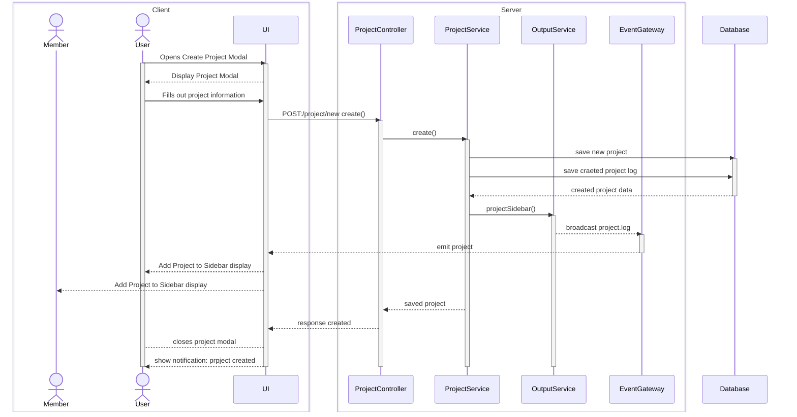

# Sequence Diagram: Create Project

```mermaid
    sequenceDiagram
        
        box Client
        actor Member
        actor User
        participant UI
        end

        box Server
        participant ProjectController
        participant ProjectService
        participant OutputService
        participant EventGateway
        end

        participant Database

        User->>UI: Opens Create Project Modal
        activate User
        activate UI
        UI-->>User: Display Project Modal
        User->>UI: Fills out project information
        UI->>ProjectController: POST:/project/new create()
        activate ProjectController
        ProjectController->>ProjectService: create()
        activate ProjectService
        ProjectService->>Database: save new project
        activate Database
        ProjectService->>Database: save craeted project log
        Database-->>ProjectService: created project data
        deactivate Database
        ProjectService->>OutputService: projectSidebar() 
        activate OutputService
        OutputService-->>EventGateway: broadcast project.log
        activate EventGateway
        EventGateway-->>UI: emit project
        deactivate EventGateway
        UI-->>User: Add Project to Sidebar display
        UI-->>Member: Add Project to Sidebar display
        ProjectService-->>ProjectController: saved project
        ProjectController-->>UI: response created
        UI-->User: closes project modal
        UI-->>User: show notification: prpject created

        deactivate OutputService
        deactivate ProjectService
        deactivate ProjectController
        deactivate UI 
        deactivate User
```
