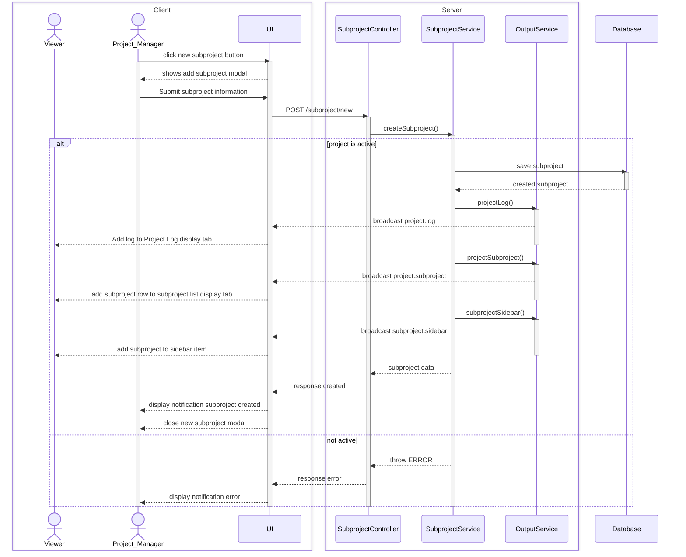

# Sequence Diagram: Create Subproject

```mermaid
    
    sequenceDiagram

        box Client
        actor Viewer
        actor Project_Manager
        participant UI
        end

        box Server
        participant SubprojectController
        participant SubprojectService
        participant OutputService
        end

        participant Database

            Project_Manager->>UI: click new subproject button
            activate UI
            activate Project_Manager

                UI-->>Project_Manager: shows add subproject modal
                Project_Manager->>UI: Submit subproject information
                UI->>SubprojectController: POST /subproject/new 
                activate SubprojectController

                    SubprojectController->>SubprojectService: createSubproject() 
                    activate SubprojectService

                        alt project is active
                            SubprojectService->>Database: save subproject
                            activate Database
                                
                                Database-->>SubprojectService: created subproject

                            deactivate Database

                            SubprojectService->>OutputService: projectLog()
                            activate OutputService
                            OutputService-->>UI: broadcast project.log
                            UI-->>Viewer: Add log to Project Log display tab
                            deactivate OutputService

                            SubprojectService->>OutputService: projectSubproject()
                            activate OutputService
                            OutputService-->>UI: broadcast project.subproject
                            UI-->>Viewer: add subproject row to subproject list display tab 
                            deactivate OutputService

                            SubprojectService->>OutputService: subprojectSidebar()
                            activate OutputService
                            OutputService-->>UI: broadcast subproject.sidebar
                            UI-->>Viewer: add subproject to sidebar item
                            deactivate OutputService

                            SubprojectService-->>SubprojectController: subproject data
                            SubprojectController-->>UI: response created
                            UI-->>Project_Manager: display notification subproject created 
                            UI-->>Project_Manager: close new subproject modal
                            
                        else not active
                            SubprojectService-->>SubprojectController: throw ERROR 
                            SubprojectController-->>UI: response error
                            UI-->>Project_Manager: display notification error

                        end

                    deactivate SubprojectService

                deactivate SubprojectController

        deactivate UI
        deactivate Project_Manager

```
