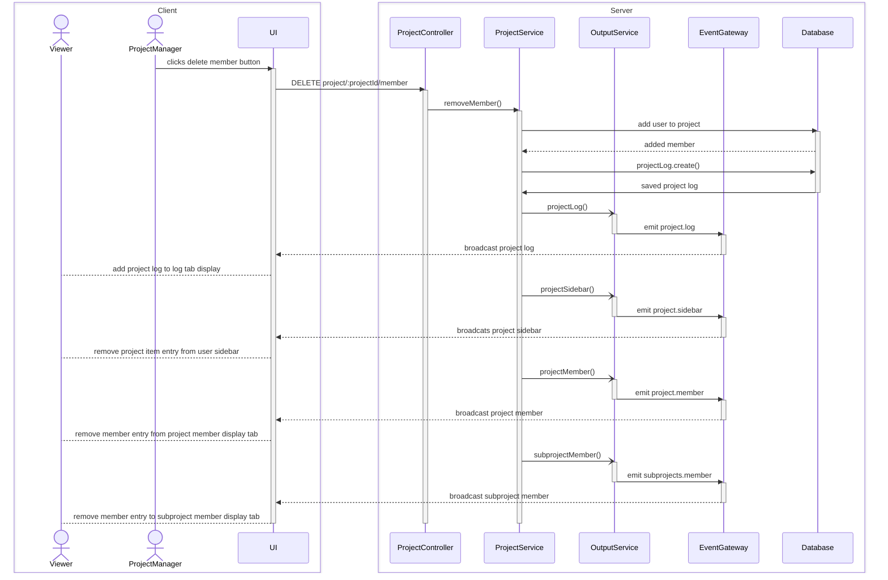

# Sequence Diagram: Delete Member

```mermaid

    sequenceDiagram

        box Client
        actor Viewer
        actor ProjectManager
        participant UI
        end

        box Server
        participant ProjectController
        participant ProjectService
        participant OutputService
        participant EventGateway
        participant Database
        end

        ProjectManager->>UI: clicks delete member button
        activate UI
        UI->>ProjectController: DELETE project/:projectId/member
        activate ProjectController
        ProjectController->>ProjectService: removeMember()
        activate ProjectService
        ProjectService->>Database: add user to project
        activate Database
        Database-->>ProjectService: added member
        ProjectService->>Database: projectLog.create()
        Database->>ProjectService: saved project log
        deactivate Database 

        ProjectService-)OutputService: projectLog()
        activate OutputService
        OutputService->>EventGateway: emit project.log
        activate EventGateway
        deactivate OutputService
        EventGateway-->>UI: broadcast project log
        deactivate EventGateway 
        UI-->Viewer: add project log to log tab display

        ProjectService-)OutputService: projectSidebar()
        activate OutputService
        OutputService->>EventGateway: emit project.sidebar
        activate EventGateway
        deactivate OutputService
        EventGateway-->>UI: broadcats project sidebar
        deactivate EventGateway 
        UI-->Viewer: remove project item entry from user sidebar

        ProjectService-)OutputService: projectMember()
        activate OutputService
        OutputService->>EventGateway: emit project.member
        activate EventGateway
        deactivate OutputService
        EventGateway-->>UI: broadcast project member
        deactivate EventGateway 
        UI-->Viewer: remove member entry from project member display tab

        ProjectService-)OutputService: subprojectMember()
        activate OutputService
        OutputService->>EventGateway: emit subprojects.member
        activate EventGateway
        deactivate OutputService
        EventGateway-->>UI: broadcast subproject member
        deactivate EventGateway 
        UI-->Viewer: remove member entry to subproject member display tab

        deactivate ProjectService

        deactivate ProjectController
        deactivate UI
```
