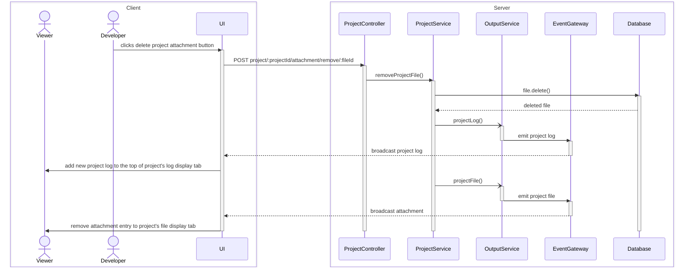

# Sequence Diagram: Delete Project Attachment

```mermaid

    sequenceDiagram

        box Client
        actor Viewer
        actor Developer
        participant UI
        end

        box Server
        participant ProjectController
        participant ProjectService
        participant OutputService
        participant EventGateway
        participant Database
        end

        Developer->>UI: clicks delete project attachment button
        activate UI
        UI->>ProjectController: POST project/:projectId/attachment/remove/:fileId
        activate ProjectController
        ProjectController->>ProjectService: removeProjectFile()
        activate ProjectService
        ProjectService->>Database: file.delete()
        activate Database
        Database-->>ProjectService: deleted file

        ProjectService-)OutputService: projectLog()
        activate OutputService
        OutputService->>EventGateway: emit project log
        activate EventGateway
        deactivate OutputService
        EventGateway-->>UI: broadcast project log
        deactivate EventGateway
        UI->>Viewer: add new project log to the top of project's log display tab

        ProjectService-)OutputService: projectFile()
        activate OutputService
        OutputService->>EventGateway: emit project file
        activate EventGateway
        deactivate OutputService
        EventGateway-->>UI: broadcast attachment
        deactivate EventGateway
        UI->>Viewer: remove attachment entry to project's file display tab

        deactivate Database
        deactivate ProjectController
        deactivate ProjectService
        deactivate UI
```
