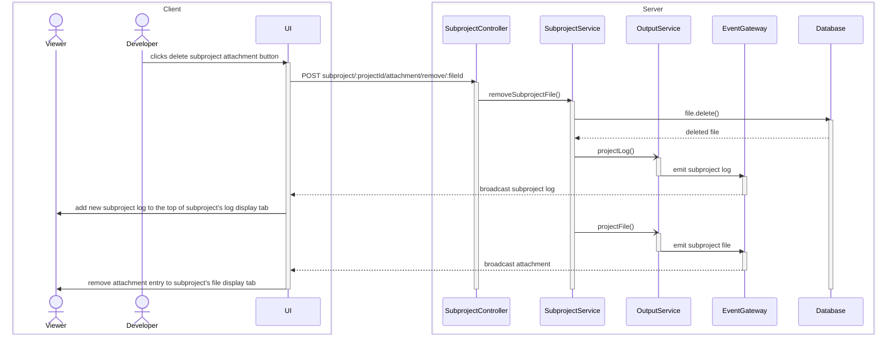

# Sequence Diagram: Delete Subproject Attachment

```mermaid

    sequenceDiagram

        box Client
        actor Viewer
        actor Developer
        participant UI
        end

        box Server
        participant SubprojectController
        participant SubprojectService
        participant OutputService
        participant EventGateway
        participant Database
        end

        Developer->>UI: clicks delete subproject attachment button
        activate UI
        UI->>SubprojectController: POST subproject/:projectId/attachment/remove/:fileId
        activate SubprojectController
        SubprojectController->>SubprojectService: removeSubprojectFile()
        activate SubprojectService
        SubprojectService->>Database: file.delete()
        activate Database
        Database-->>SubprojectService: deleted file

        SubprojectService-)OutputService: projectLog()
        activate OutputService
        OutputService->>EventGateway: emit subproject log
        activate EventGateway
        deactivate OutputService
        EventGateway-->>UI: broadcast subproject log
        deactivate EventGateway
        UI->>Viewer: add new subproject log to the top of subproject's log display tab

        SubprojectService-)OutputService: projectFile()
        activate OutputService
        OutputService->>EventGateway: emit subproject file
        activate EventGateway
        deactivate OutputService
        EventGateway-->>UI: broadcast attachment
        deactivate EventGateway
        UI->>Viewer: remove attachment entry to subproject's file display tab

        deactivate Database
        deactivate SubprojectController
        deactivate SubprojectService
        deactivate UI
```
