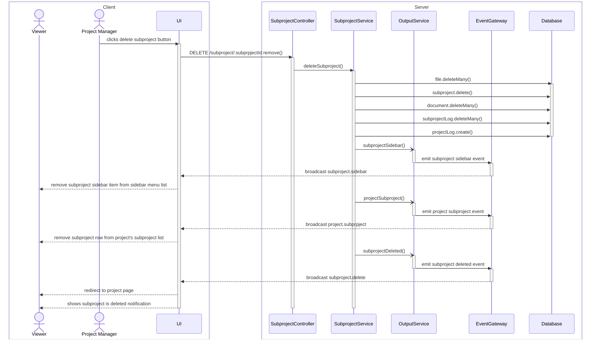

# Sequence Diagram: Delete Subproject

```mermaid

    sequenceDiagram

        box Client
        actor Viewer
        actor Project Manager
        participant UI
        end

        box Server
        participant SubprojectController
        participant SubprojectService
        participant OutputService
        participant EventGateway
        participant Database
        end

        Project Manager->>UI: clicks delete subproject button
        activate UI
        UI->>SubprojectController: DELETE /subproject/:subprpjectId remove()
        activate SubprojectController
        SubprojectController->>SubprojectService: deleteSubproject()
        activate SubprojectService
        SubprojectService->>Database: file.deleteMany()
        activate Database
        SubprojectService->>Database: subproject.delete()
        SubprojectService->>Database: document.deleteMany()
        SubprojectService->>Database: subprojectLog.deleteMany()
        SubprojectService->>Database: projectLog.create()
        deactivate Database

        SubprojectService-)OutputService: subprojectSidebar()
        activate OutputService
        OutputService->>EventGateway: emit subproject sidebar event
        activate EventGateway
        deactivate OutputService
        EventGateway-->>UI: broadcast subproject.sidebar
        deactivate EventGateway
        UI-->>Viewer: remove subproject sidebar item from sidebar menu list

        SubprojectService-)OutputService: projectSubproject()
        activate OutputService
        OutputService->>EventGateway: emit project subproject event
        activate EventGateway
        deactivate OutputService
        EventGateway-->>UI: broadcast project.subprpject
        deactivate EventGateway
        UI-->>Viewer: remove subproject row from project's subproject list

        SubprojectService-)OutputService: subprojectDeleted()
        activate OutputService
        OutputService->>EventGateway: emit subproject deleted event
        activate EventGateway
        deactivate OutputService
        EventGateway-->>UI: broadcast subproject.delete
        deactivate EventGateway
        UI-->>Viewer: redirect to project page 
        UI-->>Viewer: shows subproject is deleted notification 

        deactivate SubprojectService
        deactivate SubprojectController
        deactivate UI

```
