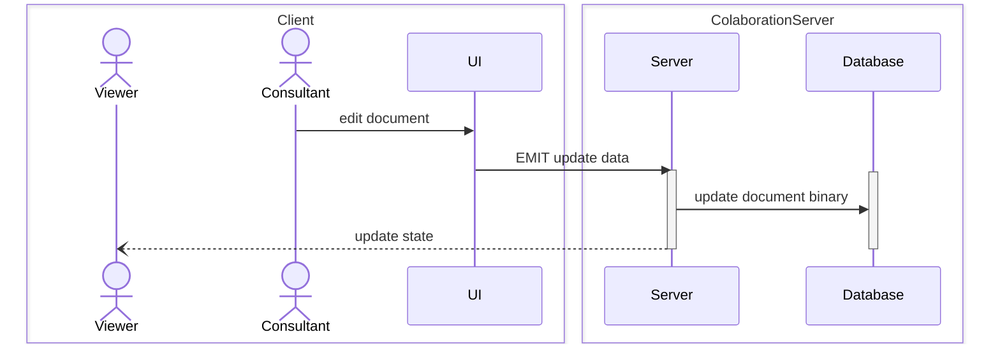

# Sequence Diagram: Edit Document

```mermaid

    sequenceDiagram

        box Client
        actor Viewer
        actor Consultant
        participant UI
        end

        box ColaborationServer
        participant Server
        participant Database
        end

        Consultant->>UI: edit document
        UI->>Server: EMIT update data
        activate Server
        activate Database
        Server->>Database: update document binary
        Server--)Viewer: update state
        deactivate Server
        deactivate Database
        
```
