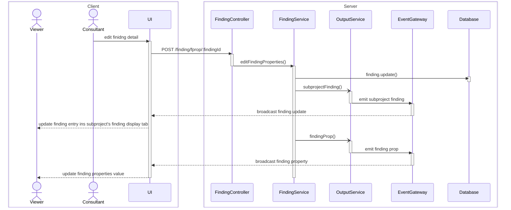

# Sequence Diagram: Add Finding Detail

```mermaid

    sequenceDiagram

        box Client
        actor Viewer
        actor Consultant
        participant UI
        end

        box Server
        participant FindingController
        participant FindingService
        participant OutputService
        participant EventGateway
        participant Database
        end


        Consultant->>UI: edit finidng detail
        activate UI
        UI->>FindingController: POST /finding/fprop/:findingId
        activate FindingController
        FindingController->>FindingService: editFindingProperties()
        activate FindingService
        deactivate FindingController
        FindingService->>Database: finding.update()
        activate Database
        deactivate Database

        FindingService-)OutputService: subprojectFinding()
        activate OutputService
        OutputService->>EventGateway: emit subproject finding
        activate EventGateway
        deactivate OutputService
        EventGateway-->>UI: broadcast finding update
        deactivate EventGateway
        UI-->>Viewer: update finding entry ins subproject's finding display tab

        FindingService-)OutputService: findingProp()
        activate OutputService
        OutputService->>EventGateway: emit finding prop
        activate EventGateway
        deactivate OutputService
        EventGateway-->>UI: broadcast finding property
        deactivate EventGateway
        UI-->>Viewer: update finding properties value


        deactivate UI
        deactivate FindingService
        
```
