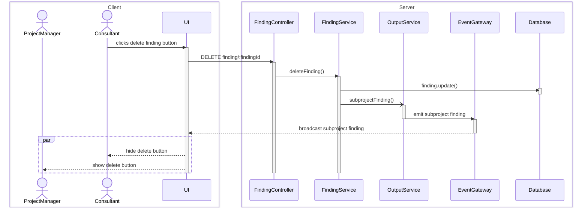

# Sequence Diagram: Request Finding Deletion

```mermaid

    sequenceDiagram

        box Client
        actor ProjectManager
        actor Consultant
        participant UI
        end

        box Server
        participant FindingController
        participant FindingService
        participant OutputService
        participant EventGateway
        participant Database
        end

        Consultant->>UI: clicks delete finding button
        activate UI
        UI->>FindingController: DELETE finding/:findingId
        activate FindingController
        FindingController->>FindingService: deleteFinding()
        activate FindingService
        
        FindingService->>Database: finding.update()
        activate Database
        deactivate Database

        FindingService-)OutputService: subprojectFinding()
        activate OutputService
        OutputService->>EventGateway: emit subproject finding
        activate EventGateway
        deactivate OutputService
        EventGateway-->>UI: broadcast subproject finding
        deactivate EventGateway 
        par
            UI-->>Consultant: hide delete button
            UI-->>ProjectManager: show delete button
        end
        deactivate FindingService
        deactivate FindingController
        deactivate UI
```
