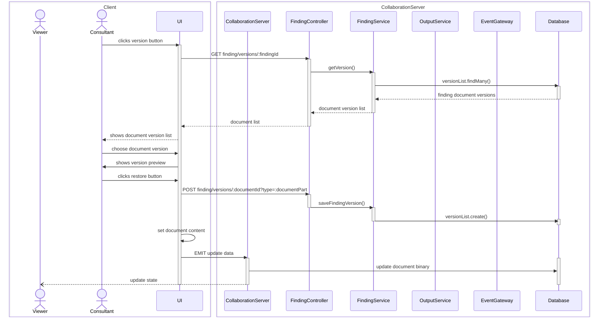

# Sequence Diagram: Restore Finding Document

```mermaid

    sequenceDiagram

        box Client
        actor Viewer
        actor Consultant
        participant UI
        end

        box CollaborationServer
        participant CollaborationServer
        participant FindingController
        participant FindingService
        participant OutputService
        participant EventGateway
        participant Database
        end

        Consultant->>UI: clicks version button
        activate UI
        UI->>FindingController: GET finding/versions/:findingId
        activate FindingController
        FindingController->>FindingService: getVersion() 
        activate FindingService
        FindingService->>Database: versionList.findMany()
        activate Database
        Database-->>FindingService: finding document versions
        deactivate Database
        FindingService-->>FindingController: document version list
        deactivate FindingService
        FindingController-->>UI: document list
        deactivate FindingController
        UI-->>Consultant: shows document version list 


        Consultant->>UI: choose document version 
        UI->>Consultant: shows version preview
        Consultant->>UI: clicks restore button 
        UI->>FindingController: POST finding/versions/:documentId?type=:documentPart
        activate FindingController
        FindingController->>FindingService: saveFindingVersion()
        activate FindingService
        deactivate FindingController
        FindingService->>Database: versionList.create()
        activate Database
        deactivate Database
        deactivate FindingService
        UI->>UI: set document content
        UI->>CollaborationServer: EMIT update data
        activate CollaborationServer
        activate Database
        CollaborationServer->>Database: update document binary
        CollaborationServer--)Viewer: update state
        deactivate CollaborationServer
        deactivate Database
        deactivate UI
        
```
