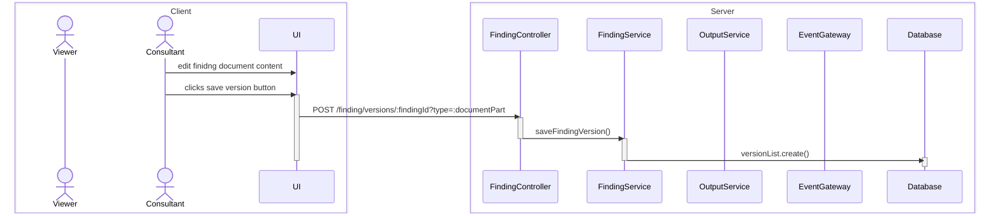

# Sequence Diagram: Save Document

```mermaid

    sequenceDiagram

        box Client
        actor Viewer
        actor Consultant
        participant UI
        end

        box Server
        participant FindingController
        participant FindingService
        participant OutputService
        participant EventGateway
        participant Database
        end


        Consultant->>UI: edit finidng document content
        Consultant->>UI: clicks save version button
        activate UI
        UI->>FindingController: POST /finding/versions/:findingId?type=:documentPart
        activate FindingController
        FindingController->>FindingService: saveFindingVersion()
        activate FindingService
        deactivate FindingController
        FindingService->>Database: versionList.create()
        activate Database
        deactivate Database

        deactivate UI
        deactivate FindingService
        
```
