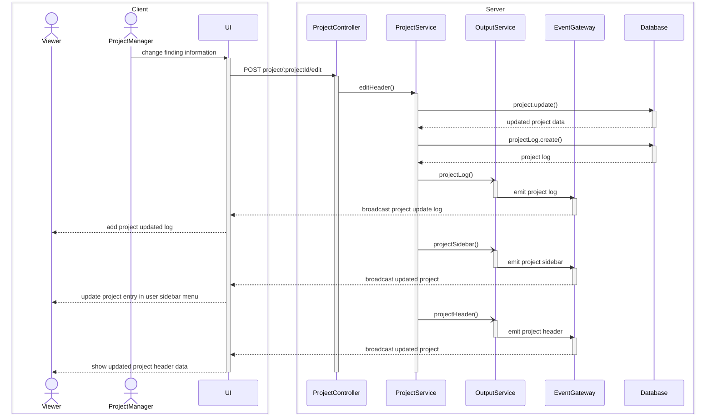

# Sequence Diagram: Update Project

```mermaid

    sequenceDiagram

        box Client
        actor Viewer
        actor ProjectManager
        participant UI
        end

        box Server
        participant ProjectController
        participant ProjectService
        participant OutputService
        participant EventGateway
        participant Database
        end

        ProjectManager->>UI: change finding information
        activate UI
        UI->>ProjectController: POST project/:projectId/edit
        activate ProjectController
        ProjectController->>ProjectService: editHeader()
        activate ProjectService

        ProjectService->>Database: project.update()
        activate Database
        Database-->>ProjectService: updated project data
        deactivate Database

        ProjectService->>Database: projectLog.create()
        activate Database
        Database-->>ProjectService: project log
        deactivate Database

        ProjectService-)OutputService: projectLog()
        activate OutputService
        OutputService->>EventGateway: emit project log 
        activate EventGateway
        deactivate OutputService
        EventGateway-->>UI: broadcast project update log
        deactivate EventGateway
        UI-->>Viewer: add project updated log

        ProjectService-)OutputService: projectSidebar()
        activate OutputService
        OutputService->>EventGateway: emit project sidebar 
        activate EventGateway
        deactivate OutputService
        EventGateway-->>UI: broadcast updated project 
        deactivate EventGateway
        UI-->>Viewer: update project entry in user sidebar menu

        ProjectService-)OutputService: projectHeader()
        activate OutputService
        OutputService->>EventGateway: emit project header 
        activate EventGateway
        deactivate OutputService
        EventGateway-->>UI: broadcast updated project
        deactivate EventGateway
        UI-->>Viewer: show updated project header data


        deactivate ProjectService
        deactivate ProjectController
        deactivate UI

       
```
