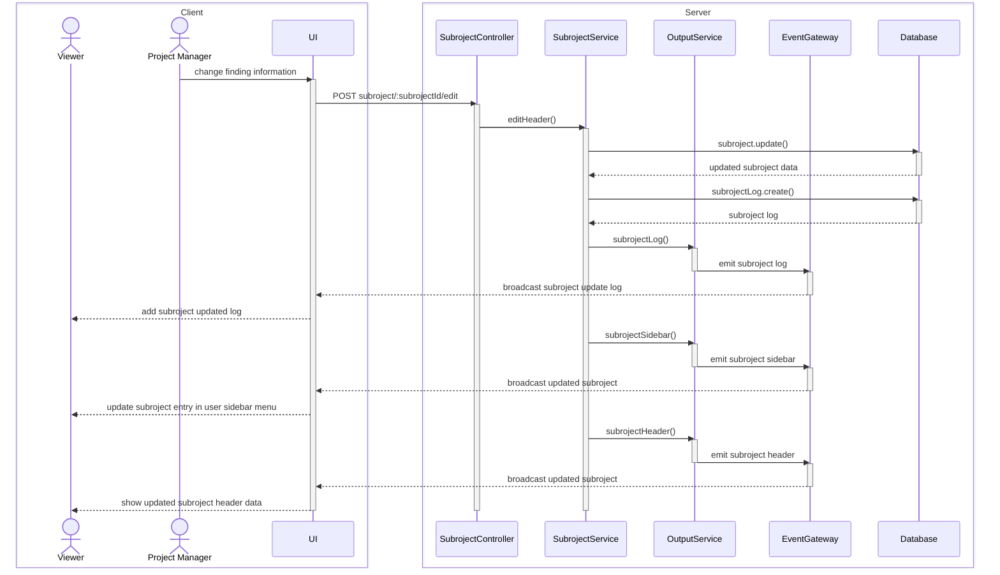

# Sequence Diagram: Update Subroject

```mermaid

    sequenceDiagram

        box Client
        actor Viewer
        actor Project Manager
        participant UI
        end

        box Server
        participant SubrojectController
        participant SubrojectService
        participant OutputService
        participant EventGateway
        participant Database
        end

        Project Manager->>UI: change finding information
        activate UI
        UI->>SubrojectController: POST subroject/:subrojectId/edit
        activate SubrojectController
        SubrojectController->>SubrojectService: editHeader()
        activate SubrojectService

        SubrojectService->>Database: subroject.update()
        activate Database
        Database-->>SubrojectService: updated subroject data
        deactivate Database

        SubrojectService->>Database: subrojectLog.create()
        activate Database
        Database-->>SubrojectService: subroject log
        deactivate Database

        SubrojectService->>OutputService: subrojectLog()
        activate OutputService
        OutputService->>EventGateway: emit subroject log 
        activate EventGateway
        deactivate OutputService
        EventGateway-->>UI: broadcast subroject update log
        deactivate EventGateway
        UI-->>Viewer: add subroject updated log

        SubrojectService->>OutputService: subrojectSidebar()
        activate OutputService
        OutputService->>EventGateway: emit subroject sidebar 
        activate EventGateway
        deactivate OutputService
        EventGateway-->>UI: broadcast updated subroject 
        deactivate EventGateway
        UI-->>Viewer: update subroject entry in user sidebar menu

        SubrojectService->>OutputService: subrojectHeader()
        activate OutputService
        OutputService->>EventGateway: emit subroject header 
        activate EventGateway
        deactivate OutputService
        EventGateway-->>UI: broadcast updated subroject
        deactivate EventGateway
        UI-->>Viewer: show updated subroject header data


        deactivate SubrojectService
        deactivate SubrojectController
        deactivate UI

       
```
