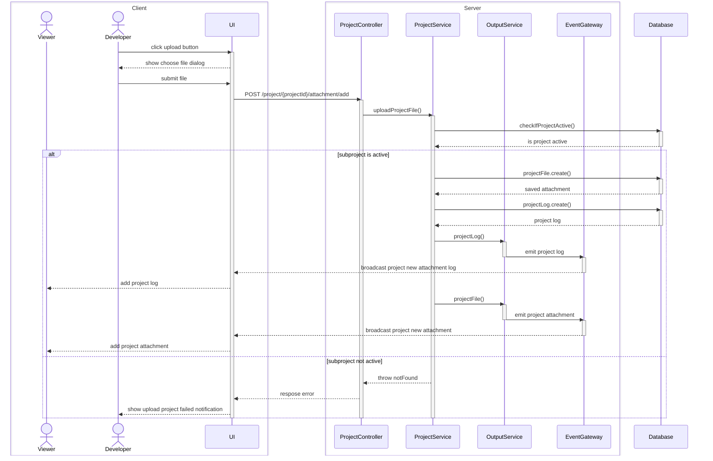

# Sequence Diagram: Upload Project Attachment

```mermaid

    sequenceDiagram

        box Client
        actor Viewer
        actor Developer
        participant UI
        end

        box Server
        participant ProjectController
        participant ProjectService
        participant OutputService
        participant EventGateway
        end

        participant Database

        Developer->>UI: click upload button
        activate UI
        UI-->>Developer: show choose file dialog
        Developer->>UI: submit file
        UI->>ProjectController: POST /project/{projectId}/attachment/add 
        activate ProjectController
        ProjectController->>ProjectService: uploadProjectFile()
        activate ProjectService
        ProjectService->>Database: checkIfProjectActive()
        activate Database
        Database-->>ProjectService: is project active
        deactivate Database
        alt subproject is active
        ProjectService->>Database: projectFile.create()
        activate Database
        Database-->>ProjectService: saved attachment
        deactivate Database
        
        ProjectService->>Database: projectLog.create()
        activate Database
        Database-->>ProjectService: project log
        deactivate Database
        
        ProjectService->>OutputService: projectLog()
        activate OutputService
        OutputService->>EventGateway: emit project log 
        activate EventGateway
        deactivate OutputService
        EventGateway-->>UI: broadcast project new attachment log
        deactivate EventGateway
        UI-->>Viewer: add project log

        ProjectService->>OutputService: projectFile()
        activate OutputService
        OutputService->>EventGateway: emit project attachment 
        activate EventGateway
        deactivate OutputService
        EventGateway-->>UI: broadcast project new attachment
        deactivate EventGateway
        UI-->>Viewer: add project attachment

        else subproject not active
        ProjectService-->>ProjectController: throw notFound
        ProjectController-->>UI: respose error
        UI-->>Developer: show upload project failed notification  
        end
        deactivate ProjectService
        deactivate ProjectController
        deactivate UI
```
