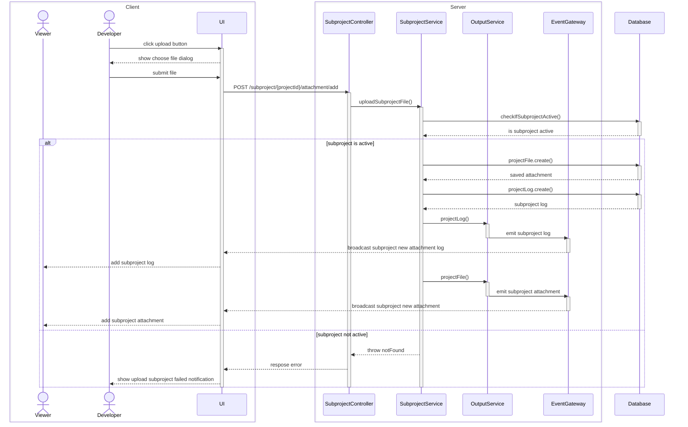

# Sequence Diagram: Upload Subproject Attachment

```mermaid

    sequenceDiagram

        box Client
        actor Viewer
        actor Developer
        participant UI
        end

        box Server
        participant SubprojectController
        participant SubprojectService
        participant OutputService
        participant EventGateway
        end

        participant Database

        Developer->>UI: click upload button
        activate UI
        UI-->>Developer: show choose file dialog
        Developer->>UI: submit file
        UI->>SubprojectController: POST /subproject/{projectId}/attachment/add 
        activate SubprojectController
        SubprojectController->>SubprojectService: uploadSubprojectFile()
        activate SubprojectService
        SubprojectService->>Database: checkIfSubprojectActive()
        activate Database
        Database-->>SubprojectService: is subproject active
        deactivate Database
        alt subproject is active
        SubprojectService->>Database: projectFile.create()
        activate Database
        Database-->>SubprojectService: saved attachment
        deactivate Database
        
        SubprojectService->>Database: projectLog.create()
        activate Database
        Database-->>SubprojectService: subproject log
        deactivate Database
        
        SubprojectService->>OutputService: projectLog()
        activate OutputService
        OutputService->>EventGateway: emit subproject log 
        activate EventGateway
        deactivate OutputService
        EventGateway-->>UI: broadcast subproject new attachment log
        deactivate EventGateway
        UI-->>Viewer: add subproject log

        SubprojectService->>OutputService: projectFile()
        activate OutputService
        OutputService->>EventGateway: emit subproject attachment 
        activate EventGateway
        deactivate OutputService
        EventGateway-->>UI: broadcast subproject new attachment
        deactivate EventGateway
        UI-->>Viewer: add subproject attachment

        else subproject not active
        SubprojectService-->>SubprojectController: throw notFound
        SubprojectController-->>UI: respose error
        UI-->>Developer: show upload subproject failed notification  
        end
        deactivate SubprojectService
        deactivate SubprojectController
        deactivate UI
```
